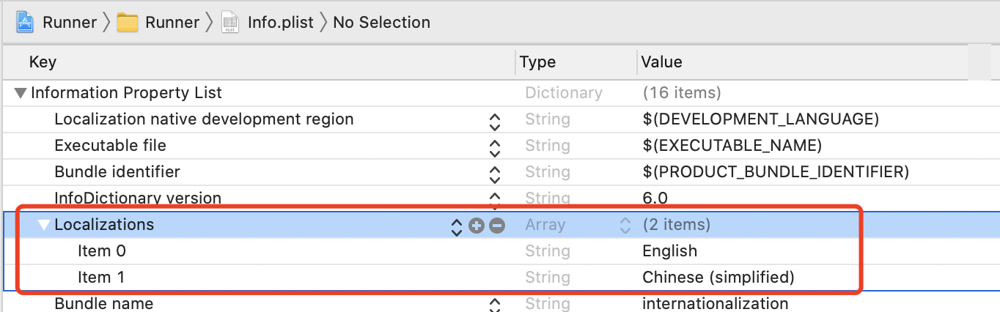

## 国际化

- #### pubspec添加依赖

```
dependencies:
  flutter:
    sdk: flutter
  flutter_localizations:
    sdk: flutter
```

- #### 设置MaterialApp

  - 在localizationsDelegates中指定哪些Widget需要进行国际化

  ```
   localizationsDelegates: [
          /// 指定本地化的字符串和一些其他的值
          GlobalMaterialLocalizations.delegate,
          /// 对应的Cupertino风格
          GlobalCupertinoLocalizations.delegate,
          /// 指定默认的文本排列方向, 由左到右或由右到左
          GlobalWidgetsLocalizations.delegate
        ]
  ```

  - supportedLocales指定要支持哪些国际化

  ```
  supportedLocales: [
          Locale('zh'),
          Locale('en'),
          ///指定语言代码、文字代码和国家代码
          // const Locale.fromSubtags(languageCode: 'zh'), // generic Chinese 'zh'
          // const Locale.fromSubtags(languageCode: 'zh', scriptCode: 'Hans'), // generic simplified Chinese 'zh_Hans'
          // const Locale.fromSubtags(languageCode: 'zh', scriptCode: 'Hant'), // generic traditional Chinese 'zh_Hant'
          // const Locale.fromSubtags(languageCode: 'zh', scriptCode: 'Hans', countryCode: 'CN'), // 'zh_Hans_CN'
          // const Locale.fromSubtags(languageCode: 'zh', scriptCode: 'Hant', countryCode: 'TW'), // 'zh_Hant_TW'
          // const Locale.fromSubtags(languageCode: 'zh', scriptCode: 'Hant', countryCode: 'HK'), // 'zh_Hant_HK'
        ]
  ```

### iOS需要做自己的配置

- 在info.plist配置



