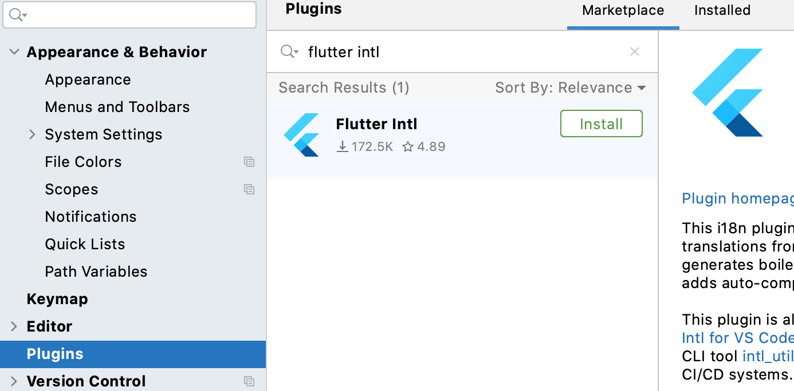
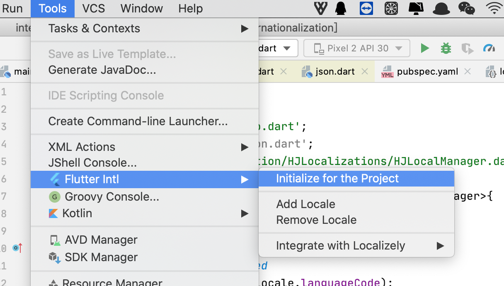
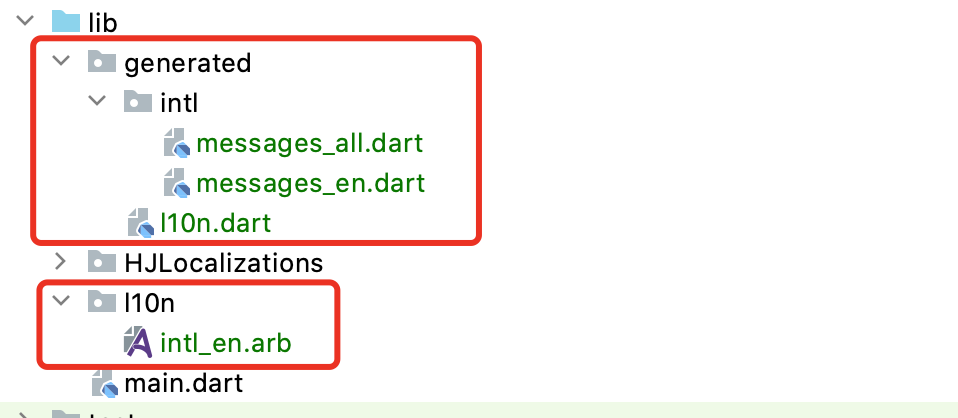
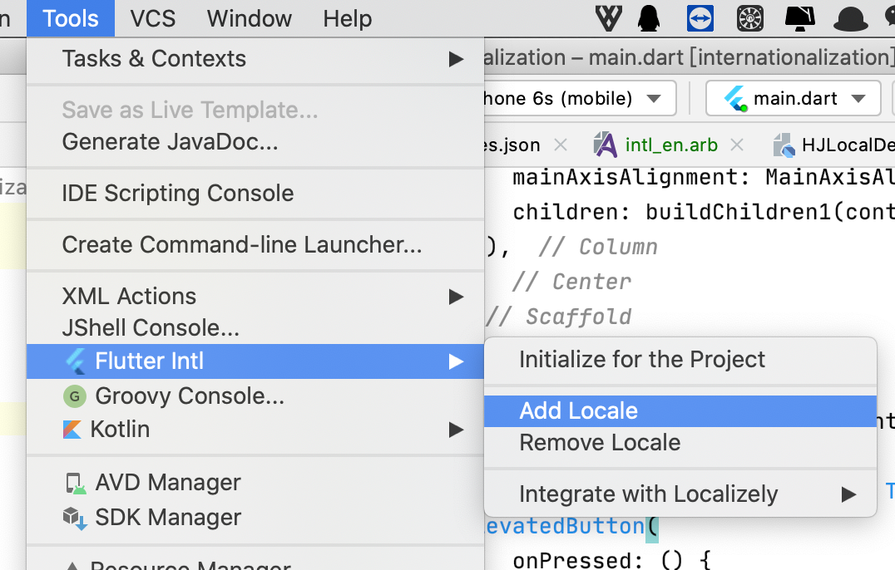
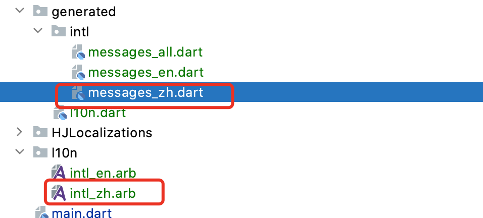

## 国际化

- #### pubspec添加依赖

```
dependencies:
  flutter:
    sdk: flutter
  flutter_localizations:
    sdk: flutter
```

- #### 设置MaterialApp

  - 在localizationsDelegates中指定哪些Widget需要进行国际化

  ```
   localizationsDelegates: [
          /// 指定本地化的字符串和一些其他的值
          GlobalMaterialLocalizations.delegate,
          /// 对应的Cupertino风格
          GlobalCupertinoLocalizations.delegate,
          /// 指定默认的文本排列方向, 由左到右或由右到左
          GlobalWidgetsLocalizations.delegate
        ]
  ```

  - supportedLocales指定要支持哪些国际化

  ```
  supportedLocales: [
          Locale('zh'),
          Locale('en'),
          ///指定语言代码、文字代码和国家代码
          // const Locale.fromSubtags(languageCode: 'zh'), // generic Chinese 'zh'
          // const Locale.fromSubtags(languageCode: 'zh', scriptCode: 'Hans'), // generic simplified Chinese 'zh_Hans'
          // const Locale.fromSubtags(languageCode: 'zh', scriptCode: 'Hant'), // generic traditional Chinese 'zh_Hant'
          // const Locale.fromSubtags(languageCode: 'zh', scriptCode: 'Hans', countryCode: 'CN'), // 'zh_Hans_CN'
          // const Locale.fromSubtags(languageCode: 'zh', scriptCode: 'Hant', countryCode: 'TW'), // 'zh_Hant_TW'
          // const Locale.fromSubtags(languageCode: 'zh', scriptCode: 'Hant', countryCode: 'HK'), // 'zh_Hant_HK'
        ]
  ```

### iOS需要做自己的配置

- 在info.plist配置


### 对自己写的字符串进行国际化

1. 写个本地化管理类

```
import 'dart:convert';

import 'package:flutter/material.dart';
import 'package:flutter/services.dart';

class HJLocalManager {

  final Locale local;
  HJLocalManager(this.local);

  static Map<String,Map<String,String>> _localValues = {
    // "en": {
    //   "title": "home",
    //   "text": "Tap",
    //   "btnText": "Pick a Time"
    // },
    // "zh": {
    //   "title": "首页",
    //   "text": "点击",
    //   "btnText": "选择一个时间"
    // }
  };

  /// 异步加载json文件
  Future<bool> loadLocalValues() async {
    final jsonStr = await rootBundle.loadString('assets/json/localValues.json');

    /// json -> map
    Map<String,dynamic> result = json.decode(jsonStr);
    /// 遍历每个键值对
    _localValues = result.map((key, value) {
      // 将Map<String, dynamic>转成Map<String, Map<String, String>>类型
      return MapEntry(key, value.cast<String,String>());
    });
    return true;
  }

  String? get title {
    return _localValues[local.languageCode]?['title'];
  }
  String? get text {
    return _localValues[local.languageCode]?['text'];
  }
  String? get btnText {
    return _localValues[local.languageCode]?['btnText'];
  }

  /// 优化方法
  static HJLocalManager of(BuildContext context) {
    return Localizations.of(context, HJLocalManager);
  }
}
```

2. 定义一个对象的Delegate类，实现重写方法，传入localizationsDelegates

```
import 'package:flutter/cupertino.dart';
import 'package:flutter/foundation.dart';
import 'package:internationalization/HJLocalizations/HJLocalManager.dart';

class HJLocalDelegate extends LocalizationsDelegate<HJLocalManager>{
  @override
  ///当前环境的Locale，是否在我们支持的语言范围
  bool isSupported(Locale locale) {
    // TODO: implement isSupported
    return ['en','zh'].contains(locale.languageCode);
  }

  @override
  /// 当Locale发生改变时（语言环境），加载对应的HYLocalizations资源
  Future<HJLocalManager> load(Locale locale) async {
    // TODO: implement load
    //return SynchronousFuture(HJLocalManager(locale));
    final localization = HJLocalManager(locale);
    await localization.loadLocalValues();
    return localization;
  }

  @override
  ///当Localizations Widget重新build时，是否调用load方法重新加载Locale资源
  bool shouldReload(covariant LocalizationsDelegate old) {
    // TODO: implement shouldReload
    return false;
  }

  static HJLocalDelegate delegate = HJLocalDelegate();
}
```

3. 使用

```
localizationsDelegates: [
        /// 指定本地化的字符串和一些其他的值
        GlobalMaterialLocalizations.delegate,
        /// 对应的Cupertino风格
        GlobalCupertinoLocalizations.delegate,
        /// 指定默认的文本排列方向, 由左到右或由右到左
        GlobalWidgetsLocalizations.delegate,
        /// 加入自定义的delegate
        HJLocalDelegate.delegate
      ]
      
      

Scaffold(
      appBar: AppBar(
        title: Text(HJLocalManager.of(context).title??''),
      ),
      body: Center(
        child: Column(
          mainAxisAlignment: MainAxisAlignment.center,
          children: [
            Text(HJLocalManager.of(context).text??'',style: TextStyle(fontSize: 20),),
            ElevatedButton(
                onPressed: () {
                  showDatePicker(
                      context: context,
                      initialDate: DateTime.now(),
                      firstDate: DateTime(2000),
                      lastDate: DateTime(3000));
                },
                child: Text(
                  HJLocalManager.of(context).btnText??'',
                  style: TextStyle(fontSize: 24),
                ))
          ],
        ),
      ),
    );
```

## 工具

### arb文件

- 安装`Flutter Intl`插件



- 初始化插件



- 会多出一些文件
  - generated是自动生成的dart代码
  - I10n是对应的arb文件目录



### 使用

- 配置`supportedLocales`

```
supportedLocales: S.delegate.supportedLocales,
```

- 配置`localizationsDelegates`,增加`S.delegate`

```
localizationsDelegates: [
        /// 指定本地化的字符串和一些其他的值
        GlobalMaterialLocalizations.delegate,
        /// 对应的Cupertino风格
        GlobalCupertinoLocalizations.delegate,
        /// 指定默认的文本排列方向, 由左到右或由右到左
        GlobalWidgetsLocalizations.delegate,
        HJLocalDelegate.delegate,
        S.delegate
      ]
```

- 编写`arb`文件

```
比如将下面json复制到intl_en.arb文件
{
  "title": "home",
  "text": "Tap",
  "btnText": "Pick a Time"
}
```

- 使用

```
S.of(context).title
```

- 添加其他语言，如中文



- 会生成对应的文件



- 配置对应的中文到`zh.arb`即可使用

### 其他语法

- 传参数配置

```
{
  "title": "首页",
  "text": "点击",
  "btnText": "选择一个时间",
  "subText": "巴卡巴卡 {name}"
}
```

- 传参使用

```
Text(S.of(context).subText('海贼·王路飞'))
```

