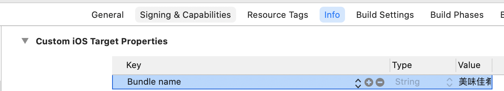

### 应用标识

##### Android

- applicationId：是打包时的应用标识 , 目录：Android/app/build.gradle

```
defaultConfig {
        // TODO: Specify your own unique Application ID (https://developer.android.com/studio/build/application-id.html).
        applicationId "com.hj.favorcate"
        minSdkVersion 16
        targetSdkVersion 30
        versionCode flutterVersionCode.toInteger()
        versionName flutterVersionName
    }
```

##### iOS

- 目录：ios/Runner/Info.plist（可以通过Xcode打开来进行修改）


### 应用名称

##### Android

- 目录：android/app/src/main/AndroidMainifest.xml

```
<application
        android:label="美味佳肴"
        android:icon="@mipmap/ic_launcher">
```

##### iOS

- 目录：ios/Runner/Info.plist（可以通过Xcode打开来进行修改）



### 应用图标

##### Android

- 官方建议将图标（icon）根据不同的dpi放置在res/mipmap文件夹下


##### iOS

- 在ios/Runner/Assets.xcassets/AppIcon.appiconset中管理（可以直接打开Xcode将对应的图标拖入）


### 应用启动图

##### Android

- android/app/src/main/res/drawable/launch_background.xml

1. 将对应的启动图片，添加到对应的minimap文件夹中


2. 修改launch_background.xml文件

```
<layer-list xmlns:android="http://schemas.android.com/apk/res/android">
    <item android:drawable="@android:color/white" />

    <!-- You can insert your own image assets here -->
    <item>
        <bitmap
            android:gravity="center"
            android:src="@mipmap/launch_image" />
    </item>
</layer-list>
```

##### iOS 

1. 将启动图片添加到资源依赖中


2. 在LaunchScreen.storyboard中，添加一个ImageView，并且添加约束


