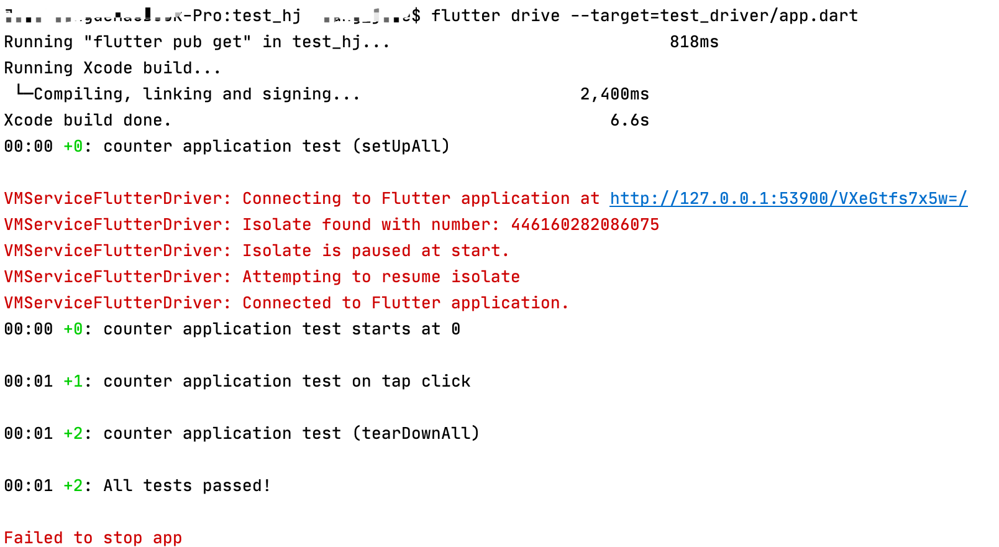

## 测试简介

### 测试

- 依赖


- 创建测试类

```

class HJCounter {

  int value = 0;

  int increment() => value++;
  int decrement() => value--;

}
```

- 在`test`文件夹里创建测试文件,通常以 `_test.dart` 命名

```
import 'package:flutter_test/flutter_test.dart';
import 'package:test/Utils/HJCounter.dart';

void main(){
  
  test('HJCounter class test', (){

    final counter = HJCounter();
    counter.increment();

    /// 通过expect来监测结果正确与否
    expect(counter.value, 1);

  });
}
```

- 测试widget

```
testWidgets('HJWidget test', (WidgetTester tester) async{

    // 注入Widget
    await tester.pumpWidget(MaterialApp(home: HJKeywords(["abc", "cba", "nba", "mba"])));

    // HJKeywords/Text
    final abcText = find.text("abc");
    final cbaText = find.text("cba");
    final icons = find.byIcon(Icons.people);

    // 断言
    expect(abcText, findsOneWidget);
    expect(cbaText, findsOneWidget);
    expect(icons, findsNWidgets(4));

  });

```

- testWidgets：flutter_test中用于测试Widget的函数；

- tester.pumpWidget：`pumpWidget` 方法会建立并渲染我们提供的 widget；

- find：`find()` 方法来创建我们的 `Finders`；

- - findsNothing：验证没有可被查找的 widgets。
  - findsWidgets：验证一个或多个 widgets 被找到。
  - findsNWidgets：验证特定数量的 widgets 被找到。

### 集成测试

- ### 添加flutter_driver依赖

```
dev_dependencies:
  flutter_test:
    sdk: flutter
  flutter_driver:
    sdk: flutter
  test: any
```

- demo应用程序代码

```
import 'package:flutter/material.dart';

void main() => runApp(MyApp());

class MyApp extends StatelessWidget {
  // This widget is the root of your application.
  @override
  Widget build(BuildContext context) {
    return MaterialApp(
      title: 'Flutter Demo',
      theme: ThemeData(
        primarySwatch: Colors.blue,
      ),
      home: MyHomePage(title: 'Flutter Demo Home Page'),
    );
  }
}

class MyHomePage extends StatefulWidget {
  MyHomePage({Key? key, this.title}) : super(key: key);

  final String? title;

  @override
  _MyHomePageState createState() => _MyHomePageState();
}

class _MyHomePageState extends State<MyHomePage> {
  int _counter = 0;

  void _incrementCounter() {
    setState(() {
      _counter++;
    });
  }

  @override
  Widget build(BuildContext context) {
    return Scaffold(
      appBar: AppBar(
        title: Text(widget.title??''),
      ),
      body: Center(
        child: Column(
          mainAxisAlignment: MainAxisAlignment.center,
          children: <Widget>[
            Text(
              'You have pushed the button this many times:',
            ),
            Text(
              '$_counter',
              key: ValueKey("counter"),
              style: Theme.of(context).textTheme.headline1,
            ),
          ],
        ),
      ),
      floatingActionButton: FloatingActionButton(
        key: ValueKey("increment"),
        onPressed: _incrementCounter,
        tooltip: 'Increment',
        child: Icon(Icons.add),
      ), // This trailing comma makes auto-formatting nicer for build methods.
    );
  }
}

```

- 1.用于启动带测试的应用程序 2.编写测试的代码


```
app.dart代码

import 'package:flutter_driver/driver_extension.dart';
import 'package:test_hj/main.dart' as app;

void main() {
  // 1.初始化Driver
  enableFlutterDriverExtension();

  // 2.启动应用程序
  app.main();
}


app_test.dart代码

import 'package:flutter_driver/flutter_driver.dart';
import 'package:test/test.dart';

void main() {

  group("counter application test", () {
    FlutterDriver? driver ;

    setUpAll(() async {
      driver = await FlutterDriver.connect();
    });

    tearDownAll(() {
      if (driver != null) {
        driver!.close();
      }
    });

    final textFinder = find.byValueKey("counter");
    final buttonFinder = find.byValueKey("increment");

    test(("starts at 0"), () async {
      if (driver != null) {
        expect(await driver!.getText(textFinder), "0");
      }
    });

    test(("on tap click"), () async {
      if (driver != null) {
        await driver!.tap(buttonFinder);
        expect(await driver!.getText(textFinder), "1");
      }
    });
  });
}
```

- 项目文件夹运行`flutter drive --target=test_driver/app.dart`

