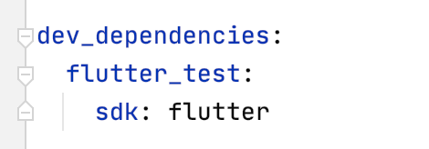

## 测试简介

- 依赖



- 创建测试类

```

class HJCounter {

  int value = 0;

  int increment() => value++;
  int decrement() => value--;

}
```

- 在`test`文件夹里创建测试文件,通常以 `_test.dart` 命名

```
import 'package:flutter_test/flutter_test.dart';
import 'package:test/Utils/HJCounter.dart';

void main(){
  
  test('HJCounter class test', (){

    final counter = HJCounter();
    counter.increment();

    /// 通过expect来监测结果正确与否
    expect(counter.value, 1);

  });
}
```

- 测试widget

```
testWidgets('HJWidget test', (WidgetTester tester) async{

    // 注入Widget
    await tester.pumpWidget(MaterialApp(home: HJKeywords(["abc", "cba", "nba", "mba"])));

    // HJKeywords/Text
    final abcText = find.text("abc");
    final cbaText = find.text("cba");
    final icons = find.byIcon(Icons.people);

    // 断言
    expect(abcText, findsOneWidget);
    expect(cbaText, findsOneWidget);
    expect(icons, findsNWidgets(4));

  });

```

- testWidgets：flutter_test中用于测试Widget的函数；

- tester.pumpWidget：`pumpWidget` 方法会建立并渲染我们提供的 widget；

- find：`find()` 方法来创建我们的 `Finders`；

- - findsNothing：验证没有可被查找的 widgets。
  - findsWidgets：验证一个或多个 widgets 被找到。
  - findsNWidgets：验证特定数量的 widgets 被找到。

