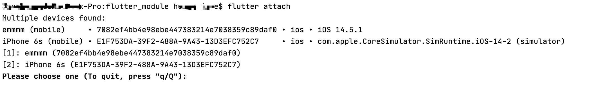
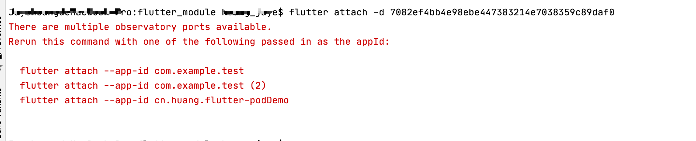
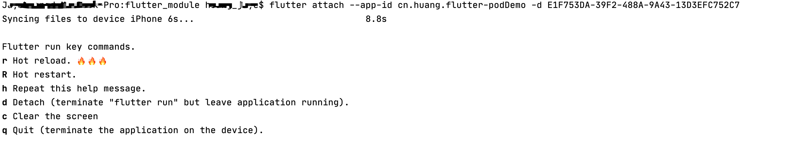

## 混合开发

### 调用原生功能

#### Camera

- image_picker插件·

```
dependencies:
  flutter:
    sdk: flutter


  # The following adds the Cupertino Icons font to your application.
  # Use with the CupertinoIcons class for iOS style icons.
  cupertino_icons: ^1.0.2
  image_picker: ^0.8.1
```

- info.plist文件：/ios/Runner/Info.plist
- 添加对相册的访问权限：Privacy - Photo Library Usage Description
- 添加对相机的访问权限：Privacy - Camera Usage Description
- 使用

```
import 'dart:io';

import 'package:flutter/material.dart';
import 'package:image_picker/image_picker.dart';

void main() {
  runApp(MyApp());
}

class MyApp extends StatefulWidget {

  @override
  _MyAppState createState() => _MyAppState();
}

class _MyAppState extends State<MyApp> {
  File? _imageFile;

  ImagePicker picker = ImagePicker();

  @override
  Widget build(BuildContext context) {

    print('build -- $_imageFile');
    return MaterialApp(
        home: Scaffold(
          appBar: AppBar(
            title: Text('混合开发'),
          ),
          body: Center(
            child: (_imageFile==null?Text('data'):Image.file(_imageFile!)),
          ),
          floatingActionButton: FloatingActionButton(
            child: Icon(Icons.camera_alt),
            onPressed: pickImage,
          ),
        ),
    );
  }

  void pickImage() async{
    /// ImageSource.camera: 拍照获取图片  ImageSource.gallery: 手机选择图库
    PickedFile? file = await picker.getImage(source: ImageSource.gallery,maxWidth: 300);
    setState(() {
      print('file - $file');
      if (file != null) {
        _imageFile = File(file.path);
      }
    });
  }

}
```

#### 其他

- 通过methodChannel 与原生通信获取，可参考另外的混编demo


#### iOS 

为了在既有的iOS应用中展示Flutter页面，需要启动 `Flutter Engine`和 `FlutterViewController`。

通常建议为我们的应用预热一个 `长时间存活` 的FlutterEngine：

- 我们将在应用启动的 app delegate 中创建一个 `FlutterEngine`，并作为属性暴露给外界。

```
class AppDelegate: UIResponder, UIApplicationDelegate {
   // 1.创建一个FlutterEngine对象
    lazy var flutterEngine = FlutterEngine(name: "my flutter engine")
    
    func application(_ application: UIApplication, didFinishLaunchingWithOptions launchOptions: [UIApplication.LaunchOptionsKey: Any]?) -> Bool {
       // 2.启动flutterEngine
        flutterEngine.run()
        return true
    }
}
```

我们也可以省略预先创建的 `FlutterEngine` ：

- 不推荐这样来做，因为在第一针图像渲染完成之前，可能会出现明显的延迟。

```
func showFlutter() {
  let flutterViewController = FlutterViewController(project: nil, nibName: nil, bundle: nil)
  present(flutterViewController, animated: true, completion: nil)
}
```


## Flutter模块调试

一旦将Flutter模块继承到你的项目中，并且使用Flutter平台的API运行Flutter引擎或UI，那么就可以先普通的Android或者iOS一样来构建自己的Android或者iOS项目了

但是Flutter的有一个非常大的优势是其快速开发，也就是hot reload。

那么对应Flutter模块，我们如何使用hot reload加速我们的调试速度呢？

- 可以使用flutter attach 



- 如上超过了一个设备，用`flutter attach -d xxx`



- 多个应用 ，用下面的指令

```
# --app-id是指定哪一个应用程序
# -d是指定连接哪一个设备
flutter attach --app-id com.xxx.xxx -d 647A32D7C-B0DD-4871-8D6E-0C5984A986CD
```

- 连接上，终端r即可刷新



